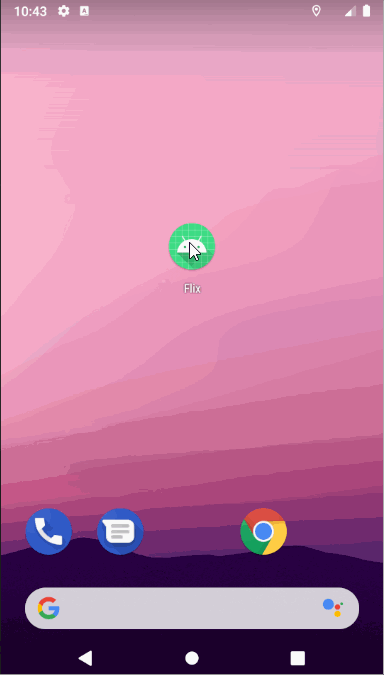
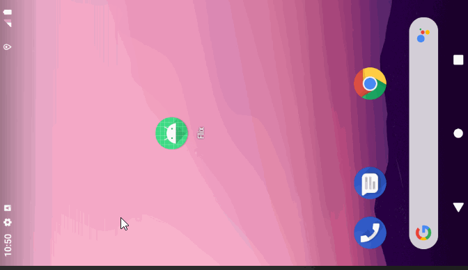

# Flix
Flix is an app that allows users to browse movies from the [The Movie Database API](http://docs.themoviedb.apiary.io/#).

## Flix Part 2

### User Stories

#### REQUIRED (10pts)

- [X] (8pts) Expose details of movie (ratings using RatingBar, popularity, and synopsis) in a separate activity.
- [X] (2pts) Allow video posts to be played in full-screen using the YouTubePlayerView.

#### BONUS

- [X] Implement a shared element transition when user clicks into the details of a movie (1 point).
- [X] Trailers for popular movies are played automatically when the movie is selected (1 point).
  - [X] When clicking on a popular movie (i.e. a movie voted for more than 5 stars) the video should be played immediately.
  - [X] Less popular videos rely on the detailed page should show an image preview that can initiate playing a YouTube video.
- [X] Add a play icon overlay to popular movies to indicate that the movie can be played (1 point).
- [X] Apply data binding for views to help remove boilerplate code. (1 point)
- [X] Add a rounded corners for the images using the Glide transformations. (1 point)

### App Walkthough GIF

### Notes
- I used this [StackOverFlow answer](https://stackoverflow.com/questions/15354621/youtube-api-android-auto-start) to figure out how to automatically load a YouTube video.
- To add a play icon overlay, I used another ImageView on top of the poster ImageView. Referred to this [StackOverFlow answer](https://stackoverflow.com/questions/11959841/how-to-place-an-imageview-on-top-of-another-imageview-in-android)
### Open-source libraries used
- [Android Async HTTP](https://github.com/codepath/CPAsyncHttpClient) - Simple asynchronous HTTP requests with JSON parsing
- [Glide](https://github.com/bumptech/glide) - Image loading and caching library for Android

---

## Flix Part 1

### User Stories

#### REQUIRED (10pts)
- [X] (10pts) User can view a list of movies (title, poster image, and overview) currently playing in theaters from the Movie Database API.

#### BONUS
- [X] (2pts) Views should be responsive for both landscape/portrait mode.
   - [X] (1pt) In portrait mode, the poster image, title, and movie overview is shown.
   - [X] (1pt) In landscape mode, the rotated alternate layout should use the backdrop image instead and show the title and movie overview to the right of it.

- [X] (2pts) Display a nice default [placeholder graphic](https://guides.codepath.org/android/Displaying-Images-with-the-Glide-Library#advanced-usage) for each image during loading
- [X] (2pts) Improved the user interface by experimenting with styling and coloring.
- [X] (2pts) For popular movies (i.e. a movie voted for more than 7 stars), the full backdrop image is displayed. Otherwise, a poster image, the movie title, and overview is listed. Use Heterogenous RecyclerViews and use different ViewHolder layout files for popular movies and less popular ones.

### App Walkthough GIF

Here's a walkthrough of implemented user stories:

GIFs created with [LiceCap](http://www.cockos.com/licecap/).

### Notes
- I used this [site](https://placeholder.com/) to generate a placeholder image.
- I had trouble figuring out where to put my placeholder image in the project. I referred to [this](https://developer.android.com/codelabs/basic-android-kotlin-training-birthday-card-app-image#1) tutorial to figure out where to place my image.

### Open-source libraries used

- [Android Async HTTP](https://github.com/codepath/CPAsyncHttpClient) - Simple asynchronous HTTP requests with JSON parsing
- [Glide](https://github.com/bumptech/glide) - Image loading and caching library for Androids

